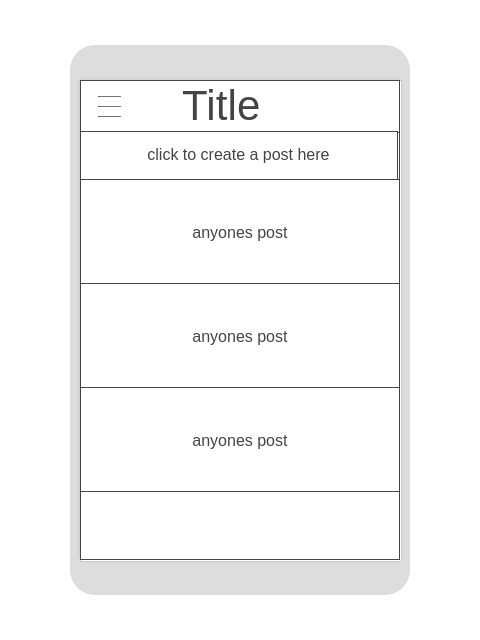
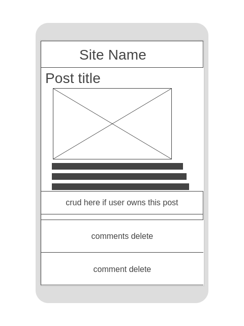
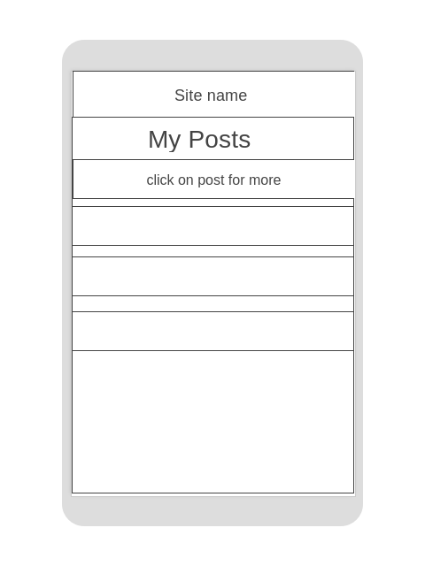
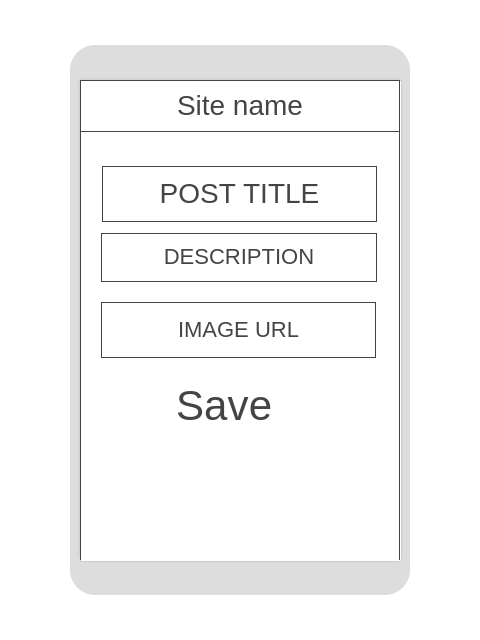

# Reddit 0.2 <!-- omit in toc -->


- [Overview](#Overview)
  - [Core Features](#Core-Features)
  - [Goals](#Goals)
  - [Challenges](#Challenges)
- [MVP](#MVP)
  - [Client (Front End)](#Client-Front-End)
    - [Wireframes](#Wireframes)
    - [Component Hierarchy](#Component-Hierarchy)
    - [Component Breakdown](#Component-Breakdown)
    - [Component Estimates](#Component-Estimates)
  - [Server (Back End)](#Server-Back-End)
    - [ERD Model](#ERD-Model)
    - [Data Heirarchy](#Data-Heirarchy)
    - [Data Heirarchy](#Data-Heirarchy-1)
  - [Dependencies](#Dependencies)
- [Post-MVP](#Post-MVP)
- [Code Showcase](#Code-Showcase)
- [Code Issues & Resolutions](#Code-Issues--Resolutions)

<br>

## Overview

_**Reddit 0.2** is a website containing a collection of user forums in the form of a title + summary post with an optional image. Other users can also comment on a post. 

### Core Features

A user can create a post,containing a title, description, and an optional image. That post will be added to the home page global post section, where any other user can see the post aswell. Users can also add comments to a post, but only the person who created the post is able to delete any comment. A post can also be edited or deleted. All of the users posts will be saved on their account, they can view a list of all their posts on the 'my posts' page

- Posts using crud
- Comment section
- Users personal list of post

### Goals

- Create an aesthitic home page, displaying other users posts, and a create post form 
- Create all components with working back end functionality
- Crud for posts and comments, depending on their level of access
- Consistently grant the correct users access to certain crud actions according to their ID

### Challenges

- Creating controllers for each data table and getting the syntax correct
<br>

## MVP

_This project will have a front end using React and a back end with a database using Ruby on Rails, using REST APIs to allow users to create, read, update, destroy posts (and comments) depending on their level of access on them. The database will have three tables including: user, post, and comments

### Client (Front End)

#### Wireframes

> Use the Wireframes section to display desktop, tablet and mobile views.
- Desktop Log in Page


- Home Page after user log in


- Page showing a single posts information


- Page showing a list of all the current users created posts


- Post edit form


## Mobile wire frames

- Post edit form










#### Component Hierarchy


``` structure

src
|__ assets/
      |__ logo
|__ components/
      |__ Header.jsx
      |__ Container.jsx
      |__ LoginPage.jsx
      |__ HomePage.jsx
      |__ HomePostCard.jsx
      |__ PostInfo.jsx
      |__ CreateFormPost.jsx
      |__ EditPage.jsx
      |__ UserPostsPage.jsx
|__ services/

```

#### Component Breakdown

> Use this section to go into further depth regarding your components, including breaking down the components as stateless or stateful, and considering the passing of data between those components.

|  Component   |    Type    | state | props | Description                                                      |
| :----------: | :--------: | :---: | :---: | :--------------------------------------------------------------- |
|    Header    | functional |   n   |   n   | _The header will contain the navigation and logo._               |
|  Container   |   class    |   y   |   n   | _The container will contain most renderings of other components and also access the api to pass down data as props _       |
|   Log in Page    |   class    |   y   |   n   | _The gallery will render the posts using cards in flexbox._      |
| Home Page | class |   y   |   n   | _Page displaying users posts, and a create post form on the side_                 |
| Home Post Card | functional |   n   |   y   | _The cards will render the post info via props._                 |
|    Edit Post Page    | Class |   y   |   y   | _Page where user can edit post, depending on their access level, updating the data in the database._ |
| User Posts Page | class |   y   |   n   | _Page displaying all of the users personal posts, upon clicking on one, will render postInfo component giving access to update and delete_                 |

#### Component Estimates

> Use this section to estimate the time necessary to build out each of the components you've described above.

| Task                | Priority | Estimated Time | Time Invested | Actual Time |
| ------------------- | :------: | :------------: | :-----------: | :---------: |
| create database and set up backend    |    H     |     2 hrs      |     TBD     |    TBD      |
| Create register and login |    H     |     3 hrs      |     TBD     |     TBD     |
| Create CRUD Actions |    H     |     5 hrs      |     TBD     |     TBD     |
| Post info page |    M     |     3 hrs      |     TBD     |     TBD     |
| Comment section with update & delete |    M     |     4 hrs      |     TBD     |     TBD     |
| Styling |    L     |     3-6 hrs      |     TBD     |     TBD     |
| TOTAL               |          |     20 hrs      |     TBD     |     TBD     |


<br>

### Server (Back End)

#### ERD Model


#### Data Heirarchy

> Use this section to display the database, table, and attribute heirarchy.

``` structure

database_db
|__ users/
|__ posts/
|__ comments/

```

#### Data Heirarchy

> Use this section to display the expected endpoints from your API.
/user
/user/:id
/user/:id/posts/:id
/user/:id/post/:id/comments
<br>

### Dependencies

> Use this section to list all supporting libraries and dependencies, and their role in the project.

|     Library      | Description                                |
| :--------------: | :----------------------------------------- |
|      React       | _Front-end_ |
|   React Router   | _To navigate site without refreshing page._ |
| Ruby on Rails | _Our backend, and database (model, view, and controllers)._ |
|     jwt      | _To grant certain users information and access._ |

<br> 

***

## Post-MVP

-Followers table and functionality


